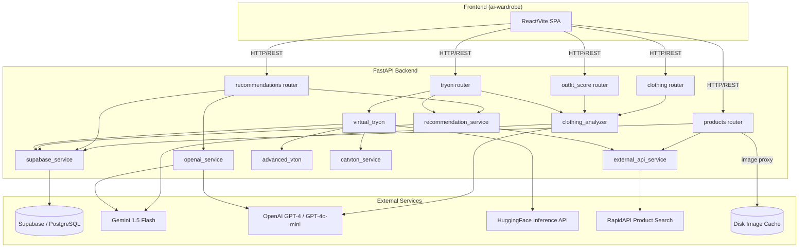

# Design Document

## Overview

StyleSync is a fashion e-commerce platform that aggregates clothing catalogs from multiple retailers
(Amazon, Myntra, Flipkart) and enhances the shopping experience with four AI-powered features:
digital wardrobe management, smart outfit recommendations, outfit scoring, and virtual try-on.

The system is built on a FastAPI/Python backend with Supabase (PostgreSQL) as the primary data
store. The frontend is a React/Vite SPA. AI capabilities are provided by Google Gemini 1.5 Flash
(primary) and OpenAI GPT-4 Vision/GPT-4o-mini (fallback), with virtual try-on handled by a
cascading pipeline of models ranging from cloud-hosted diffusion models down to a locally-trained
CNN fallback.

Key design goals:

- **Unified catalog**: Aggregate products from multiple retailer datasets into a single queryable
  surface with consistent field normalization.
- **Graceful degradation**: Every AI-dependent feature has a fallback path so the platform remains
  functional when external APIs are unavailable.
- **Stateless API layer**: All persistent state lives in Supabase; the FastAPI layer is stateless
  and horizontally scalable.
- **Image reliability**: A disk-cached image proxy shields the frontend from broken or slow
  upstream image URLs.


## Architecture

The platform follows a layered architecture with clear separation between the HTTP transport layer,
business logic services, and the data/AI integration layer.



Request flow:

1. The frontend sends REST requests to the FastAPI backend (CORS-enabled for localhost dev origins).
2. Routers validate inputs via Pydantic schemas and delegate to service modules.
3. Service modules interact with Supabase for persistence and external APIs for AI/data enrichment.
4. Responses are normalized to a consistent schema before being returned to the frontend.


## Components and Interfaces

### Routers

| Router | Prefix | Responsibility |
|---|---|---|
| `products` | `/api` | Product catalog listing, detail, image proxy |
| `clothing` | `/api` | Clothing image analysis (URL or file upload) |
| `recommendations` | `/api` | Wardrobe CRUD, outfit recommendations, wishlist |
| `outfit_score` | `/api` | Outfit photo scoring |
| `tryon` | `/api` | Virtual try-on generation, sample saving, model training |

### Services

**`supabase_service`**
- Wraps all Supabase table operations: `products`, `wardrobe_items`, `tryon_samples`,
  `outfit_scores`, `wishlist`.
- Normalizes raw Amazon/retailer DB rows into a consistent product schema via
  `_normalize_db_product`.
- Cleans Amazon image URLs by stripping dynamic resizing suffix segments via
  `clean_amazon_image_url`.
- Validates all user IDs as UUIDs before any DB operation.

**`clothing_analyzer`**
- Primary: Gemini 1.5 Flash vision API.
- Fallback: OpenAI GPT-4 Vision API.
- Final fallback: static heuristic response (`category="clothing"`, `primary_color="gray"`).
- Returns a normalized dict with: `category`, `colors`, `primary_color`, `occasion`, `season`,
  `tags`, `style`, `brand_hint`, `description`, `analysis_method`.

**`recommendation_service`**
- Implements the compatibility scoring algorithm (complementary category: +30, occasion match: +20,
  color match: +15, tag overlap: up to +24).
- Selects strategy (`wardrobe_first` vs `external_fallback`) based on whether any wardrobe item
  scores ≥ 40.
- Fetches complementary-category products from Supabase and RapidAPI.

**`openai_service`**
- Builds a structured prompt from the user's wardrobe, query, and candidate products.
- Primary: Gemini 1.5 Flash generative API.
- Fallback: OpenAI GPT-4o-mini chat completions.
- Final fallback: local rule-based stylist engine.
- Returns `model`, `recommendation`, `parsed_recommendation` (with `score`, `pairings`,
  `products`).

**`virtual_tryon`**
- Orchestrates the try-on pipeline in priority order:
  1. HF Kontext-LoRA (cloud, via `huggingface_hub.InferenceClient`)
  2. Advanced VTON (local: Segformer + SD Inpainting + IP-Adapter)
  3. CatVTON (local legacy)
  4. Composition fallback (PIL overlay)
  5. Trained CNN (local `SimpleTryOnNet`)
- Returns `{"tryon_image": "<base64_png>", "model": "<model_name>"}`.
- On total failure returns `{"tryon_image": "", "model": "failed"}`.

**`external_api_service`**
- Wraps RapidAPI Real-Time Product Search (`/search-v2`).
- Normalizes RapidAPI items to the same product schema used by `supabase_service`.
- Supports multi-source aggregation via `fetch_products_from_all_sources`.

**`advanced_vton`**
- Singleton `AdvancedVTONPipeline` using Segformer for human parsing and SD Inpainting +
  IP-Adapter for garment-conditioned inpainting.
- Lazy-loads models on first use; caches to `~/.cache/vton_models`.
- Targets 512×768 inference, upscales output to 768×1024.

### Key API Endpoints

```
GET  /health                          → {"status":"ok","service":"ai-wardrobe-backend"}
GET  /                                → {"message":"AI Wardrobe Backend Running"}

GET  /api/products                    → {products: Product[]}
GET  /api/products/{id}               → Product
GET  /api/image-proxy?url=<url>       → image bytes

POST /api/analyze-clothing            → ClothingAnalysis
POST /api/analyze-clothing-upload     → ClothingAnalysis

GET  /api/wardrobe/items?user_id=     → {items: WardrobeItem[]}
POST /api/wardrobe/items              → {status, item}
DEL  /api/wardrobe/items/{id}?user_id → {status}

POST /api/recommendations/outfit      → OutfitMatchResult
POST /api/recommendations/openai      → AIRecommendationResult

GET  /api/wishlist?user_id=           → {products: Product[]}
POST /api/wishlist                    → {status, item}
DEL  /api/wishlist/{product_id}?user_id → {status}

POST /api/score-outfit                → {score, feedback}

POST /api/tryon/predict               → TryOnResult
POST /api/tryon/save-sample           → {status, sample_id, ...}
POST /api/tryon/train                 → {status, epochs, samples, ...}
```


## Data Models

### Supabase Tables

**`products`** (sourced from retailer CSV imports)

| Column | Type | Notes |
|---|---|---|
| `id` | integer | Auto-increment primary key |
| `title` | text | Product name |
| `about_item` | text | Description / bullet points |
| `all_images` | jsonb / text | JSON array of image URLs |
| `image_url` | text | Fallback single image URL |
| `price_value` | numeric | Sale price |
| `list_price` | text / numeric | Original price |
| `brand_name` | text | Brand / platform label |
| `product_url` | text | Affiliate / product page link |
| `breadcrumbs` | text | Category path (used for gender/category inference) |
| `tags` | jsonb | Array of tag strings |
| `occasion` | jsonb | Array of occasion strings |
| `season` | jsonb | Array of season strings |
| `created_at` | timestamptz | Row creation timestamp |

Normalized product schema (output of `_normalize_db_product`):

```python
{
    "id": str,
    "title": str,
    "description": str,
    "image_url": str,
    "price": float,
    "original_price": float | None,
    "platform": str,
    "affiliate_link": str,
    "gender": "men" | "women" | "unisex",
    "category": str,
    "subcategory": str,
    "tags": list[str],
    "occasion": list[str],
    "season": list[str],
    "size_chart": dict,
    "created_at": str | None,
}
```

**`wardrobe_items`**

| Column | Type | Notes |
|---|---|---|
| `id` | uuid | Primary key (auto-generated) |
| `user_id` | uuid | Foreign key to auth.users |
| `image_url` | text | Clothing image URL |
| `category` | text | e.g., topwear, bottomwear |
| `primary_color` | text | Dominant color |
| `secondary_colors` | jsonb | Array of secondary colors |
| `occasion` | jsonb | Array of occasion strings |
| `season` | jsonb | Array of season strings |
| `detected_tags` | jsonb | Array of AI-detected tags |
| `created_at` | timestamptz | |

**`tryon_samples`**

| Column | Type | Notes |
|---|---|---|
| `id` | text | Short hex ID |
| `sample_id` | text | Unique sample identifier |
| `user_id` | text | User identifier |
| `category` | text | Clothing category |
| `source` | text | e.g., "website" |
| `body_image_url` | text | Original body image URL |
| `clothing_image_url` | text | Original clothing image URL |
| `body_image_path` | text | Local file path |
| `clothing_image_path` | text | Local file path |
| `tryon_image` | text | Local path to generated try-on image |
| `model` | text | Model used for generation |
| `clothing_analysis` | jsonb | Output of clothing_analyzer |
| `recommendations` | jsonb | Output of recommendation_service |
| `occasion` | text | |
| `created_at` | timestamptz | |

**`outfit_scores`**

| Column | Type | Notes |
|---|---|---|
| `id` | uuid | Primary key |
| `user_id` | uuid | |
| `image_url` | text | Outfit image URL |
| `score` | integer | 1–10 rating |
| `feedback` | text | Textual feedback |
| `created_at` | timestamptz | |

**`wishlist`**

| Column | Type | Notes |
|---|---|---|
| `id` | uuid | Primary key |
| `user_id` | uuid | |
| `product_id` | uuid | Stored as UUID (mapped from integer product ID) |
| `created_at` | timestamptz | |

**`users`** — managed by Supabase Auth; extended profile fields stored in a `users` public table.

**`sellers`** — seller account records with role, business name, and linked user ID.

**`cart_items`** — per-user cart entries with product ID, quantity, and selected size.

**`orders`** / **`order_items`** — order header and line-item records with status tracking.

**`notification_preferences`** — per-user opt-in/opt-out flags for email and in-app channels.

**`in_app_notifications`** — queued in-app notification records with read/unread state.

### Pydantic Request Schemas

```python
ClothingRequest(image_url: str, user_id: str)
WardrobeUploadRequest(user_id, image_url, category?, primary_color?,
                      secondary_colors, occasion, season, detected_tags)
OutfitMatchRequest(user_id, occasion, category?, gender?, primary_color?,
                   tags, limit=10, exclude_item_id?)
OpenAIRecommendationRequest(user_id, wardrobe, query, occasion?, gender?,
                             style?, weather?, product_metadata, limit=6)
WishlistRequest(user_id: str, product_id: str)
TrainRequest(epochs=5, batch_size=2, learning_rate=1e-3)
```

### Compatibility Scoring Algorithm

```
score = 0
if item.category in complementary_categories(query.category):  score += 30
if query.occasion in item.occasion:                            score += 20
if item.primary_color == query.primary_color:                  score += 15
score += min(len(item.tags ∩ query.tags) * 8, 24)
```

Complementary category map:
- `topwear` ↔ `bottomwear`, `footwear`, `accessories`
- `bottomwear` ↔ `topwear`, `footwear`, `accessories`
- `ethnic` ↔ `footwear`, `accessories`
- `footwear` / `accessories` ↔ `topwear`, `bottomwear`, `ethnic`

Strategy selection: if any wardrobe item scores ≥ 40 → `wardrobe_first`; otherwise →
`external_fallback`.


## Correctness Properties

*A property is a characteristic or behavior that should hold true across all valid executions of a
system — essentially, a formal statement about what the system should do. Properties serve as the
bridge between human-readable specifications and machine-verifiable correctness guarantees.*

Redundancy elimination notes before listing properties:

- Requirements 1.7 and 6.2/6.3 all describe the image proxy caching invariant. They are merged
  into a single cache round-trip property (Property 3).
- Requirements 3.2, 3.3, and 3.4 each describe an additive scoring rule. They are combined into
  one comprehensive scoring property (Property 5).
- Requirements 3.5 and 3.6 are complementary halves of the same strategy-selection rule. They are
  combined into one property (Property 6).
- Requirements 3.7 (empty wardrobe) is an edge case of 3.6 and is covered by Property 6.
- Requirements 2.5 (wardrobe retrieval) is covered by the wardrobe round-trip in Property 7.
- Requirements 6.3 (serve cached file) is covered by Property 3.
- Requirements 7.2 (wishlist retrieval) is covered by the wishlist round-trip in Property 11.

### Property 1: Search filter inclusion

*For any* search query string applied to the product listing endpoint, every product returned in
the response SHALL contain the query string (case-insensitive) in at least one of the following
fields: `title`, `description`, `category`, `subcategory`, or `gender`. No product that does not
match any of those fields SHALL appear in the response.

**Validates: Requirements 1.3**

### Property 2: Multi-filter conjunction

*For any* combination of `category`, `gender`, and `subcategory` filter values applied to the
product listing endpoint, every product returned in the response SHALL satisfy all supplied filter
values simultaneously. A product that fails to match any single supplied filter SHALL be excluded.

**Validates: Requirements 1.4**

### Property 3: Image proxy cache round-trip

*For any* valid external image URL, after the first successful fetch by the Image_Proxy, a second
request for the same URL SHALL be served from the disk cache (no new upstream HTTP request SHALL
be made), and the response bytes SHALL be identical to the first response.

**Validates: Requirements 1.7, 6.2, 6.3**

### Property 4: Product de-duplication invariant

*For any* product listing response, no two products in the response SHALL share the same product
ID, and no two products SHALL share the exact same title. The response SHALL contain at most one
representative for each (id, title) pair.

**Validates: Requirements 1.5**

### Property 5: Compatibility score additive rules

*For any* pair of items where one is the query item and one is a candidate, the compatibility score
of the candidate SHALL reflect the following additive contributions independently and cumulatively:
+30 if the candidate's category is complementary to the query category; +20 if the requested
occasion appears in the candidate's occasion list; +15 if the candidate's primary_color exactly
matches the query item's primary_color; up to +24 for tag overlap (8 points per shared tag, capped
at 3 tags). The total score SHALL equal the sum of all applicable contributions.

**Validates: Requirements 3.2, 3.3, 3.4**

### Property 6: Recommendation strategy selection

*For any* recommendation request, if the user's wardrobe contains at least one item with a
compatibility score ≥ 40, the response SHALL use strategy `"wardrobe_first"` and wardrobe items
SHALL appear before external products in the combined result. If no wardrobe item reaches a score
of 40 (including the case of an empty wardrobe), the response SHALL use strategy
`"external_fallback"` and external products SHALL appear before wardrobe items.

**Validates: Requirements 3.5, 3.6, 3.7**

### Property 7: Wardrobe item round-trip

*For any* valid UUID user ID and clothing image URL, adding a wardrobe item and then retrieving
the wardrobe for that user SHALL return a list that contains the added item with all submitted
fields (image_url, category, primary_color, occasion, season, detected_tags) preserved exactly.

**Validates: Requirements 2.1, 2.5**

### Property 8: Wardrobe item delete inverse

*For any* wardrobe item that has been successfully added, deleting that item by its item ID and
the owning user ID SHALL result in the item no longer appearing in subsequent wardrobe retrievals
for that user.

**Validates: Requirements 2.6**

### Property 9: Recommendation self-exclusion and category-exclusion invariants

*For any* recommendation request specifying a query item ID and query category, the response SHALL
contain no item whose ID matches the query item ID, and no wardrobe item whose category matches the
query category. Both exclusions SHALL hold simultaneously for all items in both the
`wardrobe_matches` and `external_matches` lists.

**Validates: Requirements 3.8, 3.9**

### Property 10: Compatibility score range invariant

*For any* recommendation response, every item in both `wardrobe_matches` and `external_matches`
SHALL contain a `compatibility_score` field whose value is an integer in the closed range [0, 100].
The lists SHALL be ordered by `compatibility_score` descending.

**Validates: Requirements 3.1, 3.11**

### Property 11: Wishlist idempotent add and round-trip

*For any* valid UUID user ID and valid product ID, adding the same product to the wishlist multiple
times SHALL result in exactly one entry in the wishlist for that product. Retrieving the wishlist
SHALL return all and only the products that have been added and not yet removed.

**Validates: Requirements 7.1, 7.2**

### Property 12: Wishlist remove inverse

*For any* product that has been added to a user's wishlist, removing that product by its product
ID and the owning user ID SHALL result in the product no longer appearing in subsequent wishlist
retrievals for that user.

**Validates: Requirements 7.3**

### Property 13: Amazon URL suffix stripping

*For any* Amazon product image URL that contains dot-separated dynamic suffix segments appended
after the base filename (e.g., `._AC_SX300_`, `._AC_UL320_SL1500_`), the cleaned URL produced by
`clean_amazon_image_url` SHALL contain only the base filename with its original extension and SHALL
NOT contain any of the intermediate dot-separated suffix segments.

**Validates: Requirements 6.6**

### Property 14: Image proxy SHA-256 cache naming

*For any* image URL successfully fetched by the Image_Proxy, the cached file on disk SHALL be
named using the SHA-256 hex digest of the URL string (with the appropriate image extension
appended), and that file SHALL exist in the `static/image_cache` directory after the first fetch.

**Validates: Requirements 6.2**

### Property 15: CORS origin allowlist

*For any* HTTP request originating from one of the configured allowed origins
(`http://localhost:3000`, `http://localhost:5173`, `http://localhost:8080`,
`http://localhost:8081`, `http://localhost:8082`, `http://localhost:8083`,
`http://127.0.0.1:3000`, `http://127.0.0.1:5173`), the response SHALL include an
`Access-Control-Allow-Origin` header matching that origin, an `Access-Control-Allow-Methods`
header containing GET, POST, PUT, DELETE, and OPTIONS, and an `Access-Control-Allow-Headers`
header containing Content-Type and Authorization.

**Validates: Requirements 8.4**

### Property 16: Outfit score range and feedback invariant

*For any* valid outfit scoring request, the response SHALL contain a `score` field that is an
integer in the closed range [1, 10] and a `feedback` field that is a non-empty string. When the
score is below 7, the feedback SHALL contain at least one specific, actionable improvement
suggestion.

**Validates: Requirements 4.1, 4.3**

### Property 17: Virtual try-on base64 PNG output

*For any* successful virtual try-on request (where the pipeline does not return `model="failed"`),
the `tryon_image` field in the response SHALL be a non-empty string that is valid base64-encoded
data decoding to a PNG image.

**Validates: Requirements 5.1, 5.4**

### Property 18: Try-on response completeness

*For any* completed virtual try-on request, the response SHALL include: a `clothing_analysis`
object containing at minimum `category`, `colors`, `occasion`, and `tags` fields; a
`recommendations` object containing `external_matches` and `wardrobe_matches` lists each ordered
by `compatibility_score` descending; and the total number of items across both recommendation
lists SHALL NOT exceed 6.

**Validates: Requirements 5.6, 5.7**


## Error Handling

All error responses follow FastAPI's default JSON format:

```json
{"detail": "<non-empty human-readable message>"}
```

| Scenario | HTTP Status |
|---|---|
| Product not found by ID | 404 |
| Supabase unreachable | 503 |
| Image proxy upstream failure (no cache) | 502 |
| Invalid/non-image upstream response | 502 |
| Outfit image URL unreachable | 400 |
| AI scoring service unavailable | 503 |
| Wardrobe item user ID mismatch | 400 |
| Wardrobe item not found | 404 |
| Wishlist item not found for removal | 400 |
| Invalid UUID or non-existent product ID in wishlist | 422 |
| Try-on request missing body or clothing image | 422 |
| Training request with no samples | 400 |
| Payment gateway failure | 402 |
| Seller attempts to modify another seller's product | 403 |
| Unhandled exception in any endpoint | 500 |

### Graceful Degradation Chains

**Clothing Analysis**

```
Gemini 1.5 Flash → GPT-4 Vision → static fallback
                                   {category:"clothing", primary_color:"gray",
                                    occasion:["casual"], season:["all-season"]}
```

**AI Outfit Recommendation**

```
Gemini 1.5 Flash → OpenAI GPT-4o-mini → local rule-based stylist engine
```

**Virtual Try-On Pipeline**

```
HF Kontext-LoRA → Advanced VTON (SD+IP-Adapter) → CatVTON → PIL composition → trained CNN
                                                                              → {tryon_image:"", model:"failed"}
```

**Product Catalog**

```
Supabase DB → RapidAPI (for search queries) → empty list
```

### Image Proxy Error Handling

1. Upstream fetch timeout (20 s) → treat as failed fetch.
2. Non-image Content-Type from upstream → HTTP 502.
3. Failed fetch + stale cache exists → serve stale cache.
4. Failed fetch + no cache → HTTP 502.
5. Amazon URL cleaning applied before any fetch or storage.

### Input Validation

- All `user_id` fields are validated as UUIDs before any Supabase operation; non-UUID values
  return an appropriate error without touching the database.
- Product IDs are expected to be integer strings (mapped to/from UUID format internally for the
  wishlist table).
- File uploads for try-on and clothing analysis are limited to JPEG, PNG, and WebP formats.
- Body image maximum size: 10 MB.


## Testing Strategy

The testing strategy uses a dual approach:

- **Unit / example-based tests**: verify specific behaviors, error conditions, and integration
  points with concrete inputs and expected outputs.
- **Property-based tests**: verify universal invariants across a wide range of generated inputs,
  catching edge cases that example tests miss.

Both layers are complementary. Unit tests catch concrete bugs; property tests verify general
correctness.

### Property-Based Testing

**Library**: [`hypothesis`](https://hypothesis.readthedocs.io/) (Python)

Each property test runs a minimum of **100 iterations** (configured via
`@settings(max_examples=100)`). Each test is tagged with a comment referencing the design
property it validates:

```python
# Feature: fashion-ecommerce-platform, Property N: <property_text>
```

Properties to implement as property-based tests:

| Property | Module Under Test | Generators Needed |
|---|---|---|
| P1: Search filter inclusion | `supabase_service.get_products` | random search strings, product lists |
| P2: Multi-filter conjunction | `supabase_service.get_products` | random filter combos |
| P3: Image proxy cache round-trip | `products` router image proxy | valid image URLs |
| P4: Product de-duplication | `products` router | product lists with intentional duplicates |
| P5: Compatibility score additive rules | `recommendation_service._score_item` | random item dicts |
| P6: Recommendation strategy selection | `recommendation_service.build_outfit_matches` | random wardrobes |
| P7: Wardrobe item round-trip | `supabase_service` add/get wardrobe | random UUIDs, image URLs |
| P8: Wardrobe item delete inverse | `supabase_service` add/delete/get | random wardrobe items |
| P9: Self-exclusion and category-exclusion | `recommendation_service.build_outfit_matches` | random items |
| P10: Compatibility score range + ordering | `recommendation_service.build_outfit_matches` | random requests |
| P11: Wishlist idempotent add + round-trip | `supabase_service` wishlist ops | random user/product IDs |
| P12: Wishlist remove inverse | `supabase_service` wishlist ops | random user/product IDs |
| P13: Amazon URL suffix stripping | `supabase_service.clean_amazon_image_url` | generated Amazon URLs |
| P14: Image proxy SHA-256 cache naming | `products` router image proxy | random URLs |
| P15: CORS origin allowlist | FastAPI app CORS middleware | all 8 allowed origins |
| P16: Outfit score range + feedback | `outfit_score` router | random valid requests |
| P17: Try-on base64 PNG output | `virtual_tryon.generate_try_on` | random image pairs |
| P18: Try-on response completeness | `tryon` router predict endpoint | random try-on requests |

Test isolation notes:
- Tests for P7, P8, P11, P12 require a test Supabase instance or a mock; use
  `unittest.mock.patch` to mock `supabase_service.supabase` for unit-level tests.
- Tests for P3, P14 use a temporary directory for the disk cache.
- Tests for P17, P18 mock the HF API and local model calls to avoid GPU dependency in CI.

### Unit and Example-Based Tests

| Scenario | Expected Outcome |
|---|---|
| GET /api/products with no filters | ≤ 20 products returned |
| GET /api/products/{id} for non-existent ID | HTTP 404 + detail |
| Image proxy with bad URL | HTTP 502 + detail |
| Clothing analysis: JPEG, PNG, WebP uploads | All required fields present |
| Clothing analysis: Gemini fails → GPT-4 fallback | GPT-4 Vision called |
| Clothing analysis: both APIs fail | Fallback response returned |
| Wardrobe delete: wrong user ID | HTTP 400 + detail |
| Wardrobe delete: non-existent item ID | HTTP 404 + detail |
| Outfit scoring: unreachable image URL | HTTP 400 + detail |
| Outfit scoring: AI service unavailable | HTTP 503 + detail |
| Outfit scoring: response within 30 s | Timing assertion |
| Try-on: all pipeline models fail | `{tryon_image:"", model:"failed"}` |
| Try-on: pipeline model order | Models attempted in specified order |
| Try-on: missing body or clothing image | HTTP 422 + detail |
| Try-on training: no samples | HTTP 400 + detail |
| Try-on training: samples present | Response within 5 s, status="training_active" |
| Wishlist: remove non-existent item | HTTP 400 + detail |
| Wishlist: invalid UUID user ID | HTTP 422 + detail |
| GET /health | HTTP 200 + exact JSON body |
| GET / | HTTP 200 + exact JSON body |
| Unhandled exception in endpoint | HTTP 500 + detail, service continues |
| Supabase unreachable on product listing | HTTP 503 + detail |

### Integration Tests

The following scenarios require a live or mocked external service and are run as integration tests
(1–3 examples each, not property-based):

| Scenario | Notes |
|---|---|
| Supabase product table contains Amazon/Myntra/Flipkart rows | Smoke: verify multi-source data |
| RapidAPI product search returns results | Requires `RAPID_API_KEY` in environment |
| Gemini API clothing analysis end-to-end | Requires `GEMINI_API_KEY` |
| OpenAI recommendation end-to-end | Requires `OPENAI_API_KEY` |
| HF Kontext-LoRA try-on end-to-end | Requires `HF_TOKEN` |

### Test File Organization

```
ai-wardrobe/backend/
  tests/
    test_products.py          # P1, P2, P3, P4, unit tests for product endpoints
    test_recommendation.py    # P5, P6, P9, P10, unit tests for scoring/strategy
    test_wardrobe.py          # P7, P8, unit tests for wardrobe CRUD
    test_wishlist.py          # P11, P12, unit tests for wishlist
    test_image_proxy.py       # P3, P13, P14, unit tests for image proxy
    test_clothing_analyzer.py # unit tests for analyzer fallback chain
    test_outfit_score.py      # P16, unit tests for scoring endpoint
    test_tryon.py             # P17, P18, unit tests for try-on pipeline
    test_cors.py              # P15, CORS header tests
    test_health.py            # smoke tests for /health and /
    integration/
      test_supabase.py
      test_external_apis.py
```
